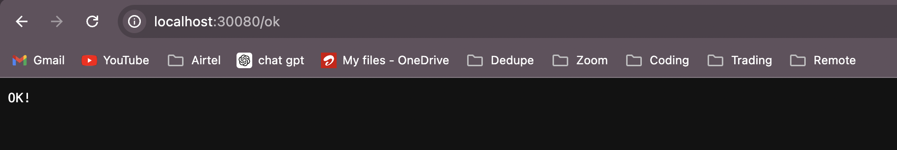
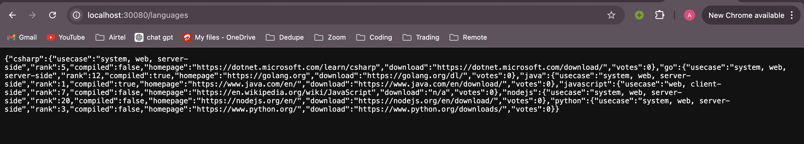
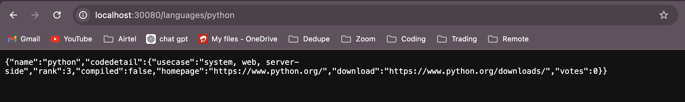
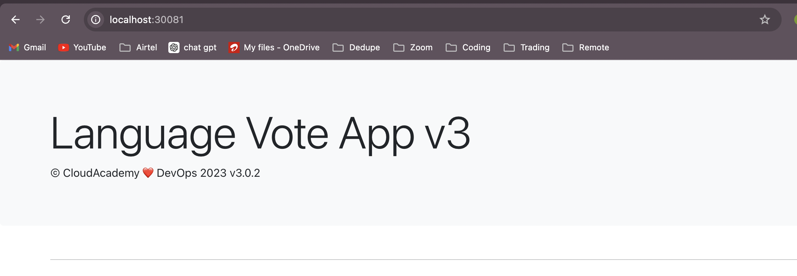

**Deploying a Web Voting Application with Kubernetes**

----

This web application is built using a mix of technologies. It's designed to be accessible to users via the internet, allowing them to vote for their preferred programming language out of six choices: C#, Python, JavaScript, Go, Java, and NodeJS.

----

**Images Used**

----

- **For Frontend:** cloudacademydevops/frontend:v11
- **For Backend:** cloudacademydevops/api:v3
- **For MongoDB:** mongo:4.2

----

**TechStack**

----

- **Frontend:** The frontend of this application is built using React and JavaScript. It provides a responsive and user-friendly interface for casting votes.

- **Backend and API:** The backend of this application is powered by Go (Golang). It serves as the API handling user voting requests. MongoDB is used as the database backend, configured with a replica set for data redundancy and high availability.

----

**Kubernetes Resources**

----

*To deploy and manage this application effectively, we leverage Kubernetes and a variety of its resources:*

- **Namespace:** Kubernetes namespaces are utilized to create isolated environments for different components of the application, ensuring separation and organization.

- **Secret:** Kubernetes secrets store sensitive information, such as API keys or credentials, required by the application securely.

- **Deployment:** Kubernetes deployments define how many instances of the application should run and provide instructions for updates and scaling.

- **Service:** Kubernetes services ensure that users can access the application by directing incoming traffic to the appropriate instances.

- **StatefulSet:** For components requiring statefulness, such as the MongoDB replica set, Kubernetes StatefulSets are employed to maintain order and unique identities.

- **PersistentVolume and PersistentVolumeClaim:** These Kubernetes resources manage the storage required for the application, ensuring data persistence and scalability.

----

**Learning**

----

Creating and deploying this cloud-native web voting application with Kubernetes offers a valuable learning experience. Here are some key takeaways:

- **Containerization:** Gain hands-on experience with containerization technologies like Docker for packaging applications and their dependencies.

- **Kubernetes Orchestration:** Learn how to leverage Kubernetes to efficiently manage, deploy, and scale containerized applications in a production environment.

- **Microservices Architecture:** Explore the benefits and challenges of a microservices architecture, where the frontend and backend are decoupled and independently scalable.

- **Database Replication:** Understand how to set up and manage a MongoDB replica set for data redundancy and high availability.

- **Security and Secrets Management:** Learn best practices for securing sensitive information using Kubernetes secrets.

- **Stateful Applications:** Gain insights into the nuances of deploying stateful applications within a container orchestration environment.

- **Persistent Storage:** Understand how Kubernetes manages and provisions persistent storage for applications with state.

By working through this project, you'll develop a deeper understanding of cloud-native application development, containerization, Kubernetes, and the various technologies involved in building and deploying modern web applications.

----

**Working Env**

----

I am using kubernetes set up by Docker Desktop. You can use kubernetes on any cloud service.

----

**Deployment Steps**

----

1) The very first step is to set up kubernetes on the docker desktop or any any individual clud servce provider.

     For deocker desktop setup, follow: `https://docs.docker.com/desktop/kubernetes/`

2) We have to do is to set up a mongodb service so that our can refer to the same. For that:
   - We have to create a secret for the mongodb access.

   `kubectl create -f mongo/mongo.secret.yaml`


   - Then we will deploy a statefulset mongodb instance.

   `kubectl create -f mongo/mongo.statefulset.yaml`


   - Then we will expose the same as NodePort service since Docker desktop won't be able to provide any external ip for loadbalancer service.

    `kubectl create -f mongo/mongo.service.yaml`

----

*Run the below command to set up replication among mongodb pods*

```
cat << EOF | kubectl exec -it mongo-0 -- mongo
rs.initiate();
sleep(2000);
rs.add("mongo-1.mongo:27017");
sleep(2000);
rs.secondaryOk();
sleep(2000);
rs.add("mongo-2.mongo:27017");
sleep(2000);
rs.secondaryOk();
sleep(2000);
cfg = rs.conf();
cfg.members[0].host = "mongo-0.mongo:27017";
rs.reconfig(cfg, {force: true});
sleep(5000);
EOF
```

*Run the below command on primary insatance to insert data into mongodb instance*

```
cat << EOF | kubectl exec -it mongo-0 -- mongo
use langdb;
db.languages.insert({"name" : "csharp", "codedetail" : { "usecase" : "system, web, server-side", "rank" : 5, "compiled" : false, "homepage" : "https://dotnet.microsoft.com/learn/csharp", "download" : "https://dotnet.microsoft.com/download/", "votes" : 0}});
db.languages.insert({"name" : "python", "codedetail" : { "usecase" : "system, web, server-side", "rank" : 3, "script" : false, "homepage" : "https://www.python.org/", "download" : "https://www.python.org/downloads/", "votes" : 0}});
db.languages.insert({"name" : "javascript", "codedetail" : { "usecase" : "web, client-side", "rank" : 7, "script" : false, "homepage" : "https://en.wikipedia.org/wiki/JavaScript", "download" : "n/a", "votes" : 0}});
db.languages.insert({"name" : "go", "codedetail" : { "usecase" : "system, web, server-side", "rank" : 12, "compiled" : true, "homepage" : "https://golang.org", "download" : "https://golang.org/dl/", "votes" : 0}});
db.languages.insert({"name" : "java", "codedetail" : { "usecase" : "system, web, server-side", "rank" : 1, "compiled" : true, "homepage" : "https://www.java.com/en/", "download" : "https://www.java.com/en/download/", "votes" : 0}});
db.languages.insert({"name" : "nodejs", "codedetail" : { "usecase" : "system, web, server-side", "rank" : 20, "script" : false, "homepage" : "https://nodejs.org/en/", "download" : "https://nodejs.org/en/download/", "votes" : 0}});

db.languages.find().pretty();
EOF
```


3) Now we have to deploy the backend service, what this backend service will do is to enable the apis which will fetch data from mongodb and store the results.

    - Create a deployment for backend api's

    `kubectl create -f backend/backend.deployment.yaml`

    - Create a service for backend api's so that we can access it from local/ cluster. The service created is of type NodePort. If you are using any cloud service, pls create a service of type loadbalancer.

    `kubectl create -f backend/backend.service.yaml`


    Now we have iur api deployed, we can test the same using the below URL's.

    - http://localhost:30080/ok

    

    - http://localhost:30080/languages

    

    - http://localhost:30080/languages/[language-name]

    


4) Now the final step is to deploy the frontend service, so that we can represent our voting results on UI.

    - Create a deployment for frontend/ UI

    `kubectl create -f frontend/frontend.deployment.yaml`

    - Create a service for UI so that we can access it from local/ cluster.

    `kubectl create -f frontend/frontend.service.yaml`

    Now we can access the frontend part at port 30081 on the localhost.

    

----

**Summary**

----

In this Project, we learnt how to deploy an application into EKS. Once deployed and up and running, we used your local workstation's browser to test out the application.